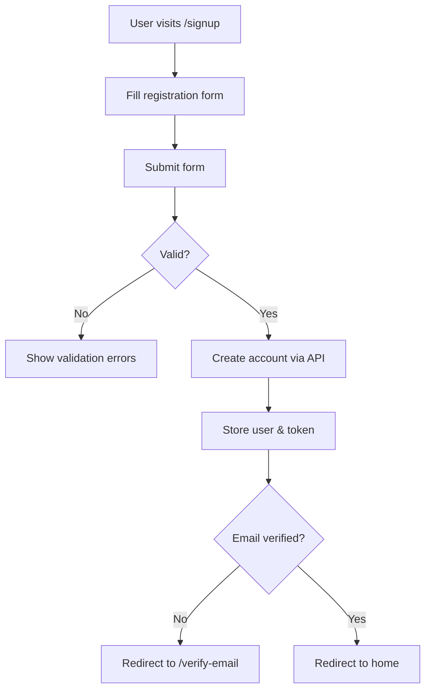
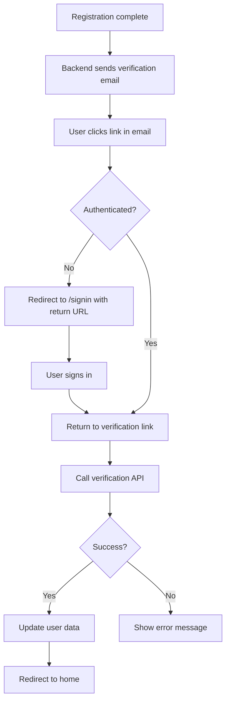
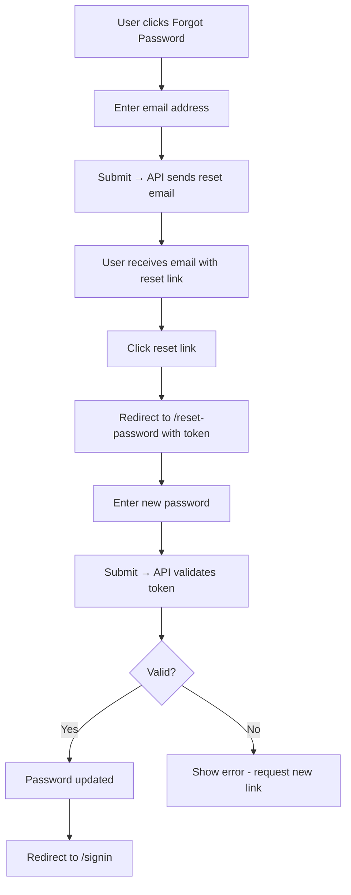
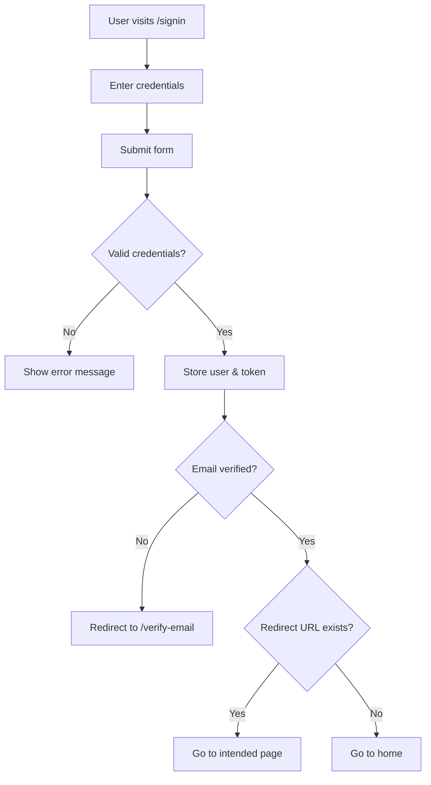

# Authentication & Email Verification Documentation

## Overview

This document provides comprehensive documentation for the TanXLM authentication system, including user registration, login, email verification, password reset, and password change functionality.

## Table of Contents

- [Features](#features)
- [Architecture](#architecture)
- [File Structure](#file-structure)
- [User Flows](#user-flows)
- [API Integration](#api-integration)
- [Middleware](#middleware)
- [Composables](#composables)
- [Components](#components)
- [Setup & Configuration](#setup--configuration)
- [Troubleshooting](#troubleshooting)

---

## Features

### ✅ Implemented Features

1. **User Registration**
   - Name, email, password validation
   - Password strength requirements (min 8 chars, uppercase, number)
   - Real-time password strength indicator
   - Terms & conditions acceptance

2. **User Login**
   - Email and password authentication
   - Remember me functionality
   - Redirect to intended page after login
   - Device-specific token generation

3. **Email Verification**
   - Automatic email sent on registration
   - Secure signed URL verification
   - Resend verification email with cooldown (60s)
   - Force verification before accessing protected pages
   - Smart redirect flow (unauthenticated users must sign in first)

4. **Password Reset (Forgot Password)**
   - Email-based password reset
   - Secure token generation
   - Token expiration handling
   - Password requirements validation

5. **Password Change (Profile)**
   - Current password verification
   - New password validation
   - Confirmation password matching
   - Success/error feedback

6. **Route Protection**
   - Auth middleware for protected routes
   - Guest middleware for public-only routes
   - Global email verification enforcement

---

## Architecture

### Technology Stack

- **Frontend**: Nuxt 4 (Vue 3 Composition API)
- **State Management**: Pinia
- **Styling**: Tailwind CSS
- **Icons**: Lucide Vue Next
- **Backend API**: Laravel (separate project)

### Design Patterns

- **Composables** - Reusable business logic
- **Store Pattern** - Centralized state management
- **Middleware** - Route protection and navigation guards
- **Component Composition** - Modular UI components

---

## File Structure

```
app/
├── composables/
│   ├── useApi.ts                    # API client wrapper
│   ├── useEmailVerification.ts      # Email verification logic
│   └── useToast.ts                  # Toast notifications
│
├── middleware/
│   ├── auth.ts                      # Protected routes middleware
│   ├── guest.ts                     # Guest-only routes middleware
│   └── 01.check-verification.global.ts  # Global email verification check
│
├── stores/
│   └── auth.ts                      # Authentication state management
│
├── pages/
│   ├── (auth)/
│   │   ├── signin.vue               # Login page
│   │   ├── signup.vue               # Registration page
│   │   ├── verify-email.vue         # Email verification page
│   │   ├── forgot-password.vue      # Forgot password page
│   │   └── reset-password.vue       # Reset password page
│   │
│   ├── profile/
│   │   └── index.vue                # User profile & password change
│   │
│   └── index.vue                    # Home page
│
└── types/
    └── models/
        └── auth.ts                  # TypeScript type definitions
```

---

## User Flows

### 1. Registration Flow



**Steps:**
1. User navigates to `/signup`
2. Fills in: First Name, Last Name, Email, Password, Confirm Password
3. Password must meet requirements (8+ chars, uppercase, number)
4. Accepts terms & conditions
5. Submits form → API creates account
6. User logged in automatically
7. If email not verified → redirected to `/verify-email`

### 2. Email Verification Flow



**Steps:**
1. User receives email with verification link
   - Format: `http://localhost:3000/verify-email?id=7&hash=xxx&signature=xxx&expires=xxx`
2. User clicks link
3. If not authenticated → redirect to signin, then back to verification
4. If authenticated → call backend verification API
5. Backend validates signed URL and marks email as verified
6. Frontend updates user data and redirects to home

### 3. Password Reset Flow



**Steps:**
1. User navigates to `/forgot-password`
2. Enters email address
3. Backend sends password reset email with token
4. User clicks link → redirected to `/reset-password?token=xxx&email=xxx`
5. User enters new password (must meet requirements)
6. Submit → backend validates token and updates password
7. Redirect to signin page

### 4. Sign In Flow



---

## API Integration

### Base Configuration

**File**: `app/composables/useApi.ts`

```typescript
const config = useRuntimeConfig();
const apiBaseUrl = config.public.apiBaseUrl; // http://tanxlm-api.test
```

### API Endpoints

#### Authentication Endpoints

| Method | Endpoint | Description | Auth Required |
|--------|----------|-------------|---------------|
| POST | `/api/v1/auth/register` | Register new user | No |
| POST | `/api/v1/auth/login` | User login | No |
| POST | `/api/v1/auth/logout` | User logout | Yes |
| GET | `/api/v1/auth/user` | Get current user | Yes |

#### Email Verification Endpoints

| Method | Endpoint | Description | Auth Required |
|--------|----------|-------------|---------------|
| POST | `/api/v1/auth/email/resend` | Resend verification email | Yes |
| GET | `/api/v1/auth/email/verify/{id}/{hash}` | Verify email address | No |

#### Password Management Endpoints

| Method | Endpoint | Description | Auth Required |
|--------|----------|-------------|---------------|
| POST | `/api/v1/auth/forgot-password` | Request password reset | No |
| POST | `/api/v1/auth/reset-password` | Reset password with token | No |
| POST | `/api/v1/auth/change-password` | Change password | Yes |

### Request/Response Examples

#### Register User

**Request:**
```typescript
POST /api/v1/auth/register
{
  "name": "John Doe",
  "email": "john@example.com",
  "password": "Password123",
  "password_confirmation": "Password123"
}
```

**Response:**
```typescript
{
  "data": {
    "user": {
      "uuid": "123e4567-e89b-12d3-a456-426614174000",
      "name": "John Doe",
      "email": "john@example.com",
      "email_verified_at": null,
      "created_at": "2026-01-28T10:00:00.000000Z",
      "updated_at": "2026-01-28T10:00:00.000000Z"
    },
    "token": "1|abc123def456..."
  }
}
```

#### Verify Email

**Request:**
```typescript
GET /api/v1/auth/email/verify/7/188d68f97b974f9264369b62c1dc0423ca528df4?signature=xxx&expires=xxx
```

**Response:**
```typescript
{
  "message": "Email verified successfully"
}
```

---

## Middleware

### 1. Auth Middleware (`auth.ts`)

**Purpose**: Protect routes that require authentication and email verification

**Location**: `app/middleware/auth.ts`

**Usage:**
```typescript
definePageMeta({
  middleware: 'auth'
})
```

**Logic:**
1. Check if user is authenticated
   - If not → redirect to `/signin?redirect={currentPath}`
2. Check if email is verified
   - If not → redirect to `/verify-email`
3. Allow access if both checks pass

**Applied to:**
- `/profile` - User profile page
- `/orders` - Orders page
- Any other protected pages

---

### 2. Guest Middleware (`guest.ts`)

**Purpose**: Restrict authenticated users from accessing public-only pages

**Location**: `app/middleware/guest.ts`

**Usage:**
```typescript
definePageMeta({
  middleware: 'guest'
})
```

**Logic:**
1. Check if user is authenticated
   - If yes and email not verified → redirect to `/verify-email`
   - If yes and email verified → redirect to `/`
2. Allow access if not authenticated

**Applied to:**
- `/signin` - Login page
- `/signup` - Registration page
- `/forgot-password` - Forgot password page
- `/reset-password` - Reset password page

---

### 3. Global Verification Middleware (`01.check-verification.global.ts`)

**Purpose**: Enforce email verification across the entire application

**Location**: `app/middleware/01.check-verification.global.ts`

**Runs**: Automatically on every route change (global middleware)

**Logic:**
1. Skip if on server-side (SSR)
2. Skip if on excluded paths:
   - `/signin`
   - `/signup`
   - `/forgot-password`
   - `/reset-password`
   - `/verify-email`
3. If user is authenticated but email not verified:
   - Redirect to `/verify-email`

**Benefits:**
- No page can be accessed without email verification
- Works even if page doesn't have `middleware: 'auth'`
- Prevents URL manipulation bypasses

---

## Composables

### 1. useEmailVerification

**Purpose**: Reusable email verification logic

**Location**: `app/composables/useEmailVerification.ts`

**Usage:**
```typescript
const {
  isVerifying,
  verificationSuccess,
  verificationFailed,
  errorMessage,
  verifyEmail,
  resendVerificationEmail,
  needsVerification
} = useEmailVerification()
```

**Methods:**

#### `verifyEmail(id, hash, signature?, expires?)`
Verify email address using link parameters from email.

**Parameters:**
- `id` - User ID
- `hash` - Verification hash
- `signature` - Optional signed URL signature
- `expires` - Optional expiration timestamp

**Returns:** `Promise<void>`

**Example:**
```typescript
await verifyEmail('7', '188d68f...', 'signature123', '1769593061')
```

---

#### `resendVerificationEmail()`
Resend verification email with 60-second cooldown.

**Returns:** `Promise<void>`

**Example:**
```typescript
await resendVerificationEmail()
```

---

#### `needsVerification()`
Check if current user needs email verification.

**Returns:** `boolean`

**Example:**
```typescript
if (needsVerification()) {
  console.log('User needs to verify email')
}
```

---

### 2. useAuthStore

**Purpose**: Centralized authentication state management

**Location**: `app/stores/auth.ts`

**State:**
```typescript
{
  user: User | null,
  token: string | null
}
```

**Getters:**
- `isAuthenticated` - Returns `true` if user is logged in
- `currentUser` - Returns current user object

**Actions:**

#### `register(data: RegisterRequest)`
Register new user account.

**Example:**
```typescript
await authStore.register({
  name: 'John Doe',
  email: 'john@example.com',
  password: 'Password123',
  password_confirmation: 'Password123'
})
```

---

#### `login(data: LoginRequest)`
Authenticate user and store token.

**Example:**
```typescript
await authStore.login({
  email: 'john@example.com',
  password: 'Password123',
})
```

---

#### `logout()`
Sign out user and clear session.

**Example:**
```typescript
await authStore.logout()
```

---

#### `fetchUser()`
Fetch current user data from API.

**Example:**
```typescript
await authStore.fetchUser()
```

---

#### `forgotPassword(email: string)`
Request password reset email.

**Example:**
```typescript
await authStore.forgotPassword('john@example.com')
```

---

#### `resetPassword(data)`
Reset password using token from email.

**Example:**
```typescript
await authStore.resetPassword({
  token: 'reset-token-123',
  email: 'john@example.com',
  password: 'NewPassword123',
  password_confirmation: 'NewPassword123'
})
```

---

#### `changePassword(data)`
Change password for authenticated user.

**Example:**
```typescript
await authStore.changePassword({
  current_password: 'OldPassword123',
  password: 'NewPassword123',
  password_confirmation: 'NewPassword123'
})
```

---

## Components

### Password Requirements Validation

All password input forms include real-time validation:

**Requirements:**
- ✓ At least 8 characters
- ✓ One uppercase letter
- ✓ One number

**Visual Indicators:**
- Password strength meter (4 levels: red, orange, yellow, green)
- Checkmark (✓) or circle (○) for each requirement
- Color-coded feedback (green = met, gray = not met)

**Password Mismatch:**
- Real-time check if password and confirm password match
- Red border on confirm password field if mismatch
- Error message: "Passwords do not match"

---

## Setup & Configuration

### Environment Variables

**File**: `.env`

```env
API_BASE_URL=http://tanxlm-api.test
```

### Runtime Configuration

**File**: `nuxt.config.ts`

```typescript
export default defineNuxtConfig({
  runtimeConfig: {
    public: {
      apiBaseUrl: process.env.API_BASE_URL
    }
  }
})
```

### Required Backend Configuration

The Laravel backend must:

1. **Send verification emails** with links pointing to frontend:
   ```
   http://localhost:3000/verify-email?id={id}&hash={hash}&signature={signature}&expires={expires}
   ```

2. **Send password reset emails** with links pointing to frontend:
   ```
   http://localhost:3000/reset-password?token={token}&email={email}
   ```

3. **Return proper error messages** for handled cases:
   - "already verified" - When email already verified
   - "Invalid signature" - When verification link expired/invalid
   - "User not found" - When user doesn't exist

---

## Troubleshooting

### Issue: Cannot redirect to home after verification

**Symptoms:**
- Email verification succeeds
- Stays on verify-email page instead of redirecting

**Solution:**
The composable uses `window.location.href = '/'` for full page reload to ensure middleware sees updated user data.

**Code:**
```typescript
// Full page reload ensures fresh middleware check
setTimeout(() => {
  window.location.href = '/';
}, 2000);
```

---

### Issue: User can access pages without verifying email

**Symptoms:**
- Unverified user can browse the site
- Verification enforcement not working

**Solution:**
Check that `01.check-verification.global.ts` middleware is present and properly configured.

**Verify:**
1. File exists: `app/middleware/01.check-verification.global.ts`
2. Prefix `01.` ensures it runs before other middleware
3. Suffix `.global.ts` ensures it runs on all routes

---

### Issue: "Guest" middleware error on reset-password page

**Symptoms:**
- Error: "Unknown middleware: guest"
- Cannot access reset-password page

**Solution:**
Ensure `guest.ts` middleware file exists.

**Create if missing:**
```typescript
// app/middleware/guest.ts
export default defineNuxtRouteMiddleware((to, from) => {
  const authStore = useAuthStore();

  if (authStore.isAuthenticated) {
    if (!authStore.user?.email_verified_at) {
      return navigateTo('/verify-email');
    }
    return navigateTo('/');
  }
});
```

---

### Issue: Verification link doesn't work

**Symptoms:**
- Click verification link in email
- Shows "Invalid signature" or "Link expired"

**Possible Causes:**
1. **Link expired** - Verification links have expiration time
2. **Signature mismatch** - Frontend URL doesn't match backend config
3. **Already verified** - Email already verified (should show success)

**Solution:**
1. Check `expires` parameter is in the future
2. Ensure backend `APP_URL` matches frontend URL
3. Use "Resend verification email" button for new link

---

### Issue: Infinite redirect loop

**Symptoms:**
- Page keeps redirecting endlessly
- Browser shows "too many redirects" error

**Possible Causes:**
1. Middleware conflict
2. Verification check on verify-email page itself

**Solution:**
Ensure global middleware excludes `/verify-email`:

```typescript
const excludedPaths = [
  '/signin',
  '/signup',
  '/forgot-password',
  '/reset-password',
  '/verify-email'  // Must be excluded!
];
```

---

## Security Best Practices

1. **Tokens**
   - Stored in Pinia with persistence
   - Sent via `Authorization: Bearer {token}` header
   - Cleared on logout

2. **Password Requirements**
   - Minimum 8 characters
   - Must include uppercase letter
   - Must include number
   - Validated on both frontend and backend

3. **Email Verification**
   - Uses Laravel signed URLs
   - Includes expiration timestamp
   - Signature prevents tampering
   - Requires authentication before verification

4. **Password Reset**
   - Token-based with expiration
   - One-time use tokens
   - Requires email and token match

5. **Route Protection**
   - Multiple layers: page middleware + global middleware
   - Email verification enforced site-wide
   - Guest routes prevent authenticated access

---

## Best Practices

### Adding New Protected Pages

1. Add middleware to page:
```typescript
definePageMeta({
  middleware: 'auth'
})
```

2. Access user in component:
```typescript
const authStore = useAuthStore()
const user = authStore.currentUser
```

### Adding New Public Pages

If page should be accessible to unverified users, add to exclusion list:

```typescript
// app/middleware/01.check-verification.global.ts
const excludedPaths = [
  // ... existing paths
  '/your-new-public-page'
];
```

### Error Handling

Always handle API errors gracefully:

```typescript
try {
  await authStore.login(credentials)
} catch (error: any) {
  // Check for specific error types
  if (error.message.includes('401')) {
    addToast('Invalid credentials', 'error')
  } else if (error.errors) {
    // Laravel validation errors
    const firstError = Object.values(error.errors)[0]
    addToast(firstError[0], 'error')
  } else {
    addToast('An error occurred', 'error')
  }
}
```

---

## Support

For issues or questions:
1. Check this documentation first
2. Review troubleshooting section
3. Check browser console for errors
4. Verify backend API is running and accessible
5. Ensure environment variables are configured correctly

---

**Last Updated**: January 28, 2026
**Version**: 1.0.0
**Nuxt Version**: 4.2.2
